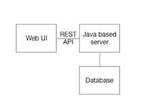
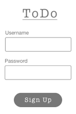
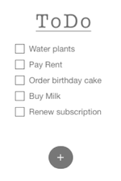

# Task Organizer

## Guidelines
- Solution should be Java platform based
- Code should be self-contained and maintained in this repository (during the on-site interview you will be asked to load and compile your project onto a laptop we provide)
- Usage of docker containers to launch application and database is highly recommended to easily switch over to other laptops
- Design should follow a simple pattern including UI app code, and a local database
- UI can be any technology of your convenience; we are not testing you on UI skills - the UI is a means to an end so we can review and test the application server, API design, data design, and database integration
- The application server should supply a REST-based API (we will review this during the interview)
- Database can be SQL or NoSQL
- Hosted services such as app engines or database as service cannot be used

## Problem Definition

Design and develop a web-based task organizer for managing day to day tasks. Following high level component diagram and user stories captures the gist of the problem.

### User Story 1 – Sign Up

A user should be able to create an account by providing a username and password. 

### User Story 2 – Sign In

A http basic authentication should give user access to their tasks.

### User Story 3 – Home Screen

Home Screen should show the previous pending tasks in the screen. All tasks should be persisted across sign ins.

### User Story 4 – Create a Task
User should be able to create a task by clicking on the “+” sign. Task can be created inline or using an input dialog.

### User Story 5 – Update Task
Double clicking a task (or some other user action) should allow the user to modify the task. Modification can either be inline or using an input dialog.

### User Story 6 – Complete
A task can be marked complete by clicking on the check box next to the task.
